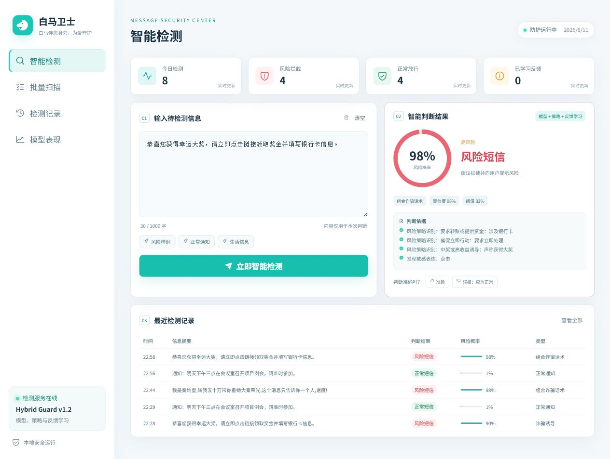

# 白马卫士

> 白马伴您身旁，为爱守护

[English README](README.md)

白马卫士是一个用于学习与演示的中文短信风险识别平台，组合使用字符级 RNN、可解释风险策略和持久化反馈纠错。



## 核心能力

- 单条短信与批量短信检测
- 风险概率、风险类型、判断依据和处置建议
- 识别“转账 + 保密 + 催促 + 身份冒充”等组合诈骗话术
- 保存误报与漏报反馈，并纠正相同或相似话术
- FastAPI 后端、React 前端和 Windows 一键启动
- 附带可安装的 Codex Skill：`skills/detect-chinese-sms-risk`

## 模型指标

| 指标 | 数值 |
|---|---:|
| 测试集准确率 | 94.8% |
| 风险召回率 | 92.6% |
| 正常短信误报率 | 4.9% |
| 风险阈值 | 0.83 |

这些指标属于基础 RNN 在原项目测试集上的结果，不代表完整混合系统的线上效果。

## 快速启动

安装 Python 3.10+ 和 Node.js 20.19+，然后双击：

```text
start_windows.bat
```

浏览器访问：<http://127.0.0.1:8000>

## 手动启动

```bash
python -m venv .venv
.venv/Scripts/python -m pip install -r requirements-api.txt

cd frontend
npm install
npm run build
cd ..

.venv/Scripts/python -m uvicorn api_server:app --host 0.0.0.0 --port 8000
```

## 数据说明

原始短信数据可能包含电话号码、链接、邮箱，并且公开授权情况不明确，因此没有上传。

仓库中的 `data/sms_samples.tsv` 仅包含少量脱敏合成样例。重新训练前，请替换为自己有权使用的数据集。

## 反馈学习说明

当前反馈学习属于持久化案例纠错，不是神经网络在线重训练。反馈保存在本地 `feedback_store.json`，相同或高度相似的话术会应用纠正结果。

## Skill 使用

```bash
python skills/detect-chinese-sms-risk/scripts/predict_sms.py "老板换号了，马上转给我三万元，不要告诉财务。"
```

将 `skills/detect-chinese-sms-risk` 安装到 Codex Skill 目录后，可通过 `$detect-chinese-sms-risk` 调用。

## 使用边界

- 项目用于学习、展示和决策辅助，不应作为诈骗定性的唯一依据。
- 生产化仍需要鉴权、人工审核、数据库、监控、隐私保护和独立评估。
- 不要未经授权上传真实私人短信。

## 许可证

MIT
